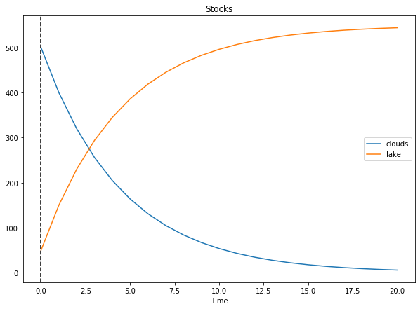

# System Flow

> System Dynamic library for Python!

> Syntaxically clean and extendable library for modelling complex multidomain dynamic systems.

> Simulation, System Dynamics, Modelling


---

## Example

```python
import systemflow as sf

# Define Stocks 
clouds = sf.Stock("clouds", initial_value=500)
lake = sf.Stock("lake", initial_value=50)

# Link the stocks
rain = clouds >> lake

# Create flow logic to the links
condensation = clouds * 0.2

# Set the logic to the flow's 
rain.valve = condensation

# Simulate and display results
system = sf.System(rain, stop=20)
system.simulate()
system.plot()
```


System Flow uses the Python's magic methods extensively. Even though magic method "```>>```"  is a bitwise operation, it also resembles a transistion. A flow is formed using this operation in between two stocks. This is also equal to ```Flow(sf.Stock("a"), sf.Stock("b"))```.
In addition, using arithmetical operations (such as "+", "-", "*" and "/") to stocks forms a computator.

---
## Terminology
- Stock: A container for value
- Flow: A link from one Stock to another
    - Valve: attribute of a Flow that controls how much value is passed through per time step. Can be constant or varying using computators.
- Computator: computation class for computing the values of valves or used for analytical purposes. Do not affect the stocks directly and produces values on demand.
- System: collection stocks, flows and computators that form a system. Used for the actual simulation.

Analogy:
- Stock can be seen as a water container
- Flow can be seen a pipe that transport water from one container (stock) to another
    - valve is like a valve in the pipe: controls the amount of water flowing per second
- Computator is kind of the wiring for the valve: does not directly affect the amount of water in each container but can be used (but not necessarily) to control how much the valve is open in each time step
- System could be seen as the components in a water treatment plant

---
## Alchemy
> Creating Flows from Stocks
```python
a = sf.Stock("a", initial_value=5)
b = sf.Stock("b", initial_value=5)
a >> b
# Same as Flow(a, b)
```

> Creating Computator from Stocks
```python
a = sf.Stock("a", initial_value=5)
b = sf.Stock("b", initial_value=5)
a + b
# Computator for a.value + b.value 
```
